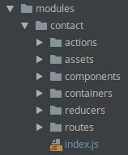

# Module Loader

Inspired by [Mantrajs](https://github.com/mantrajs/mantra-core) this package build upons the idea to modulize and abstract.

See the [medium article](https://medium.com/wertarbyte/structure-your-react-apps-the-mantra-way-3a831ffd1580) to get the idea behind this.

It's still in pretty early stages. We use this in a few projects to see if it works. If you have further ideas feel free to submit a PR

## Installation
```shell
npm i --save @wertarbyte/module-loader
```

## Goal

The goal is to have one single entrance spot where all modules come together. This package provides the "glue" to attach all together.

It will provide various logics for each module:
* Routes
* Reducers
* Redux Actions
* API calls

The end result could look something like this:


```javascript
import {createApp} from '@wertarbyte/module-loader';
...

const store = configureStore({}, history);

const context = {
  store,
};

const app = createApp(context);
app.loadModule(Core);
app.loadModule(Home);
app.loadModule(Contact);
app.init();

export default () => (
  <Provider store={store}>
    <MuiThemeProvider theme={theme}>
      <ConnectedRouter history={history}>
        <Switch>
          <Application>{app.routes}</Application>
        </Switch>
      </ConnectedRouter>
    </MuiThemeProvider>
  </Provider>
);
```

With that everything is handled. Reducers get injected and routes will be stacked to be used later for the rendering pipeline.

There is currently no limitation on how many modules can be loaded.

## Usage

### configureStore
In order to inject reducers dynamically we need `asyncReducers` which basically just means a hook for the module loader.

Note how we add `asyncReducers` in the `createReducer` method and add them dynamically in `store.injectReducer` when a new module is loaded.

```javascript
import {applyMiddleware, combineReducers, compose, createStore} from 'redux';
import {routerMiddleware, routerReducer} from 'react-router-redux';

export const createReducer = asyncReducers =>
  combineReducers({
    routing: routerReducer,
    ...asyncReducers,
  });

export default function(initialState, browserHistory) {
  const routermw = routerMiddleware(browserHistory);
  return createStore(
    createReducer(),
    initialState,
    process.env.NODE_ENV !== 'production' && window.devToolsExtension
      ? compose(applyMiddleware(routermw), window.devToolsExtension())
      : compose(applyMiddleware(routermw)),
  );
}
```

### Module Config
Every module has an `index.js` in its root to expose the inner parts.

Let's assume our module `contact` has:
 * **actions** as an array
 * **reducers** 
 * **routes** as a function



```javascript
import {createModule} from '@wertarbyte/module-loader';
import * as actions from './actions';
import reducers from './reducers';
import routes from './routes';

export default createModule('contact', { actions, reducers, routes });
```

### Entry File

Load modules, init the app and mount your modules to get started

```javascript
import {createApp} from '@wertarbyte/module-loader';
import configureStore, {createReducer} from './configureStore';
...

const store = configureStore({}, history);


const app = createApp({
  store,
  replaceReducers: (reducers) => {
    store.replaceReducer(createReducer(reducers));
  },
});
app.loadModule(Core);
app.loadModule(Home);
app.loadModule(Contact);
app.init();

export default () => (
  <Provider store={store}>
    <MuiThemeProvider theme={theme}>
      <ConnectedRouter history={history}>
        <Switch>
          <Application>{app.routes}</Application>
        </Switch>
      </ConnectedRouter>
    </MuiThemeProvider>
  </Provider>
);
```

## API

### Creation Methods

|Name            |Type        |Description
|----------------|------------|--------------------------------
|createApp       | `func`     | Returns an app instance to load modules.
|createModule    | `func`     | Returns an module instance for creating a new module.

### App class

|Name            |Type        |Description
|----------------|------------|--------------------------------
|checkForInit    | `func`     | Throws error message if app is already initialized.
|init            | `func`     | Set flag that app is initialized.
|loadModule      | `func`     | Loads a module.

### Module class

|Name            |Type        |Default     |Description
|----------------|------------|------------|--------------------------------
|actions         | `object`   | {}         | Defines the actions.
|api             | `object`   | {}         | Defines the API calls.
|loaded          | `boolean`  | false      | Defines if the module has already been loaded once.
|name*           | `string`   |            | Defines a unique name.
|reducers        | `func`     | null       | Defines the reducers.
|routes          | `func`     | null       | Defines the routes.
